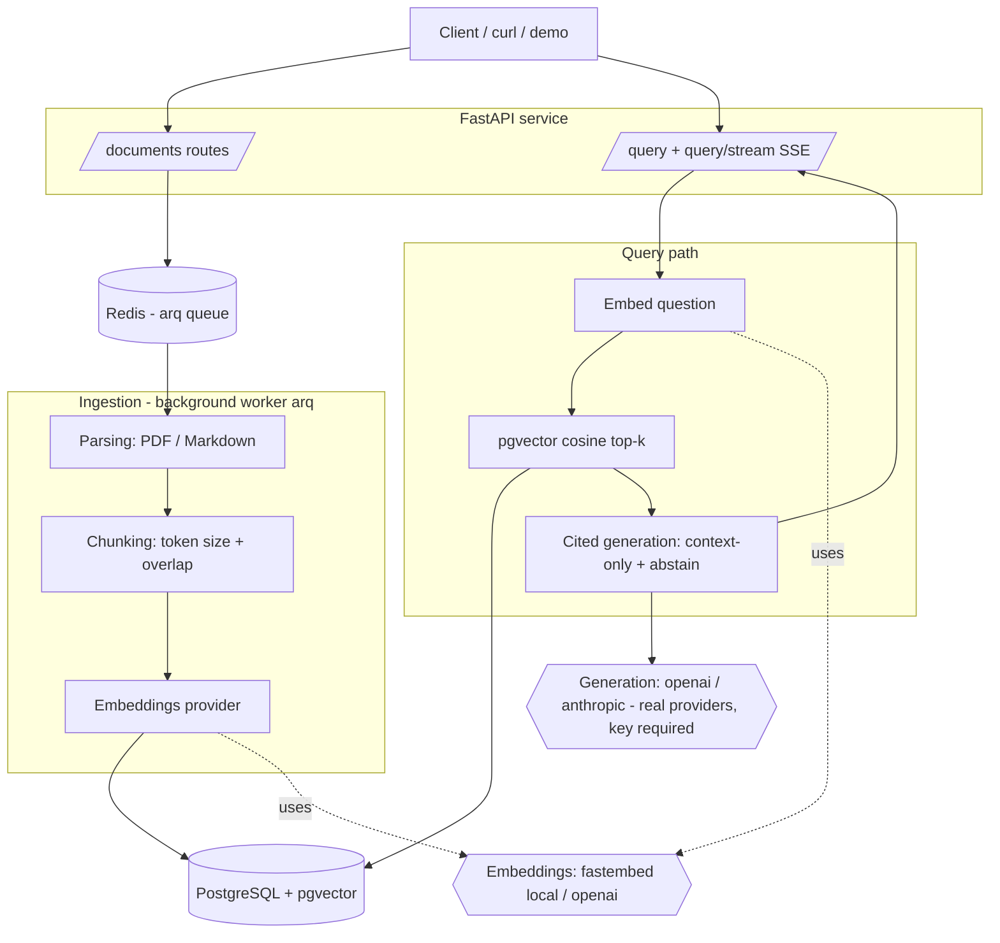

# Architecture — enterprise-rag

This document is the design contract. Code in later milestones must match it, or this
document is updated in the same change.

Guiding principle: **keep it simple; do not introduce abstractions before they are needed.**
Clarity over cleverness. Every decision below states Why / Alternatives / Trade-offs /
Limitations.

## 1. System overview

## 2. Layer responsibilities

| Layer | Responsibility | Depends on |
|---|---|---|
| api | HTTP surface, validation, SSE | ingestion, retrieval, generation |
| parsing | bytes → normalized text + structure | — |
| chunking | text → ordered chunks (+ metadata) | — |
| embeddings | text → vectors (provider-agnostic) | local model / provider SDK |
| ingestion | orchestrate parse→chunk→embed→store; enqueue/track jobs | parsing, chunking, embeddings, persistence |
| retrieval | question → top-k chunks + metrics | embeddings, persistence |
| generation | context + question → cited answer (or config error) | LLM provider |
| persistence | models, repository, migrations | Postgres/pgvector |
| jobs | durable background execution | Redis/arq |
| evaluation | metrics over a fixed dataset | retrieval, generation |

## 3. Key decisions

### D1 — PostgreSQL + pgvector for storage *and* vectors
- **Why:** one datastore holds documents, metadata, and embeddings; you already run and
  back up Postgres; document + chunks are inserted/deleted transactionally.
- **Alternatives:** Pinecone, Weaviate, Qdrant (dedicated vector DBs).
- **Trade-offs:** a dedicated vector DB scales further and ships hybrid search built-in;
  pgvector trades peak scale for radically simpler operations and no second service/bill.
- **Limitations:** the `vector(N)` dimension is fixed per database; switching embedding
  providers (384 ↔ 1536 dims) means a fresh volume and re-ingest.

### D2 — Local embeddings, real generation
- **Why:** retrieval should work with zero keys so anyone can clone-and-run; answers must
  be truthful, so generation uses a **real** provider — never a simulated one.
- **Alternatives:** hosted embeddings only; or a fake/stub LLM for a keyless "demo".
- **Trade-offs:** a stub LLM would make the repo look interactive without keys, but it
  would be dishonest and useless as an engineering signal — rejected on purpose.
- **Limitations:** generated answers require an OpenAI or Anthropic key; without one the
  API returns a configuration error (ingestion and retrieval still work).

### D3 — Redis + arq for background ingestion
- **Why:** parsing/embedding a document is slow; uploads must return immediately with a
  job to track.
- **Alternatives:** Celery (heavier), FastAPI BackgroundTasks (in-process, not durable).
- **Trade-offs:** arq adds Redis as a dependency but stays small and async-native.
- **Limitations:** at-least-once semantics; ingestion steps must be idempotent (planned).

### D4 — uv + SQLAlchemy 2.0 + structlog + pydantic-settings
- **Why:** fast reproducible deps; typed ORM with migrations; JSON logs; typed config.
- **Alternatives:** Poetry/pip-tools; raw SQL; stdlib logging; os.environ.
- **Trade-offs:** newer tooling (uv) over the most familiar; judged worth it.
- **Limitations:** none material at this scale.

## 4. Data model (target, built later)

- **documents**(id, filename, source_type, sha256 unique, status, num_chunks, error, timestamps)
- **chunks**(id, document_id fk, chunk_index, content, token_count, metadata jsonb, embedding vector(N)) — HNSW index
- **ingestion_jobs**(id, document_id fk, status, attempts, last_error, timestamps)
- **query_logs**(optional) — question, retrieved_chunk_ids, answer, latency_ms, provider

## 5. API surface (target)

| Method | Path |
|---|---|
| GET | /health |
| POST/GET/DELETE | /documents · /documents/{id} · /documents/{id}/status |
| POST | /query |
| POST | /query/stream (SSE) |

## 6. Testing strategy

- **Offline tests, no simulated product behavior.** Tests mock the LLM provider **at its
  boundary** (no network); the shipped application never contains a fake provider — an
  unconfigured generation provider returns a real configuration error.
- **Deterministic embeddings in tests** via a seeded test double, so retrieval order is
  reproducible without downloading a model in CI.
- **Unit:** chunker boundaries/overlap, markdown header extraction, citation validation.
- **Integration:** real Postgres+pgvector via a CI service container; upload →
  wait-for-`ready` → query; assert citations resolve to retrieved chunks.
- **Evaluation:** `eval/dataset.yaml` (answerable / unanswerable / expected sources) →
  recall@k, MRR, abstention correctness, citation correctness. Metrics printed, never
  hard-coded into docs as claims.

## 7. Cost model for the demo

| Path | Cost |
|---|---|
| Ingestion + retrieval (local FastEmbed) | **$0**, no keys |
| Generated answers (OpenAI `gpt-4o-mini`, ~20 demo questions) | **≈ $0.02** |

## 8. Deliberate exclusions

auth/multi-tenancy · reranking · hybrid BM25+vector · web UI · OCR/scanned PDFs ·
runtime multi-dimension embeddings · autoscaling · fine-tuning. Tracked in the README
roadmap/limitations, not hidden.
